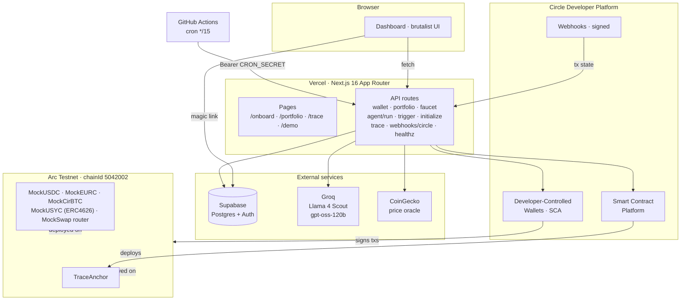
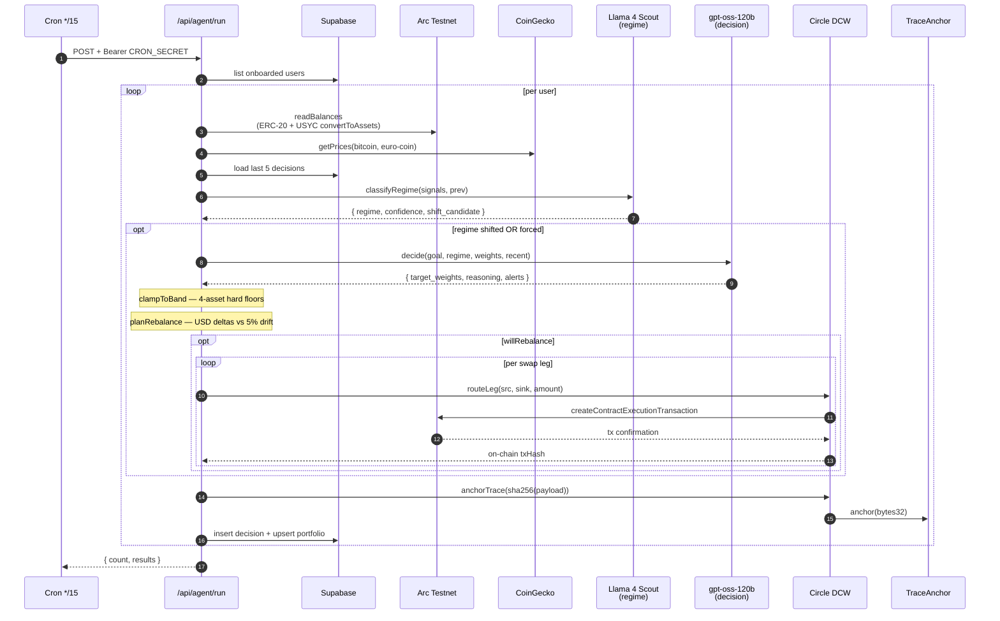
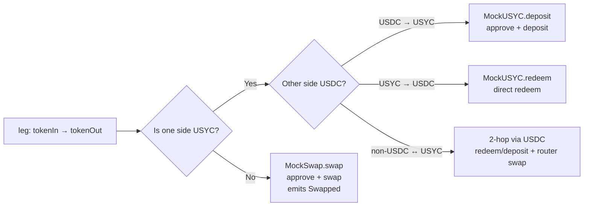
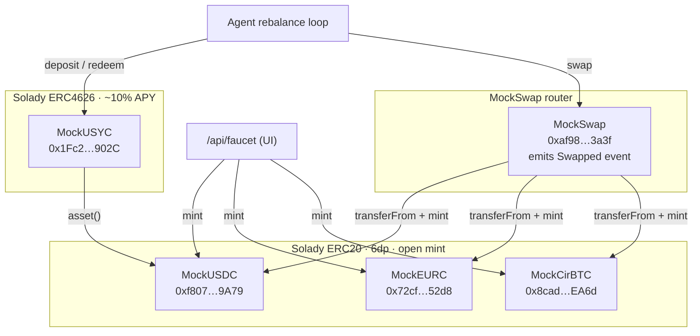

# Trapeza

> **Trapeza** (τράπεζα) · Greek for *the table*. The money-changers' tables of the Athenian agora — the original site of capital allocation, and the etymological root of modern banking. *"Money-changers leaned on their tables."* Trapeza is an adaptive portfolio agent that takes its seat at the same table, now powered by an LLM and settled on Arc.

**Live:** https://trapeza-gamma.vercel.app
**Demo (no sign-in):** https://trapeza-gamma.vercel.app/demo
**Built for:** [Agora Agents Hackathon](https://canteen.so) · Canteen × Circle · RFB-04

---

## What it does

Pick a risk profile. Faucet some testnet tokens. A Groq-hosted agent runs every fifteen minutes against your Circle wallet:

1. Reads the market (BTC/ETH 24h, realised vol, USDC/USDT depeg) from CoinGecko.
2. Classifies the regime — `risk-on`, `risk-off`, or `neutral` — via Llama 4 Scout.
3. If the regime shifted, asks gpt-oss-120b for target weights across four assets — USDC (cash + gas), USYC (yield), EURC (safe-FX), cirBTC (risk) — inside hard goal bands, plus a plain-English memo.
4. Settles the rebalance onchain by routing through one of three primitives: `MockSwap.swap()` for vanilla pairs, `MockUSYC.deposit/redeem` for the yield leg, and a 2-hop combo (via USDC) for USYC↔non-USDC moves.
5. Hashes the entire reasoning trace (signals + regime + decision + swaps) and pins the SHA-256 to a `TraceAnchor` contract.

Every decision is independently verifiable on [testnet.arcscan.app](https://testnet.arcscan.app) — the trace hash, the per-leg `Swapped` events, the anchor tx.

The cash sleeve doesn't sit at 0%. Idle USDC autosweeps into the USYC vault to earn ~10% APY between rebalances; the agent maintains a per-mandate floor on raw USDC just for gas.

## Why this wins on the rubric

Judging is **30 % agentic sophistication · 30 % traction · 20 % Circle tool usage · 20 % innovation.**

- **Agency.** Regime classification, target weights inside hard bands, rebalance timing, multi-leg routing (including 2-hop via USDC for any USYC↔non-USDC move). Every decision carries a plain-English memo and is hard-clamped to the mandate's bands so a hallucination can't violate the user contract.
- **Traction.** Sign-in is one email magic link. Onboarding mints a Circle dev-controlled SCA wallet on Arc Testnet. An in-app faucet card mints 1,000 mock USDC / EURC and 0.0013 mock cirBTC with one click — no leaving the dashboard. A `/demo` route lets curious judges browse the full UI with mock data.
- **Circle tools (five surfaces).**
  - **USDC** — native gas + the cash leg
  - **Developer-Controlled Wallets** (`@circle-fin/developer-controlled-wallets`) — per-user SCA custody; signs every rebalance + faucet tx server-side
  - **Smart Contract Platform** (`@circle-fin/smart-contract-platform`) — compiles + deploys `TraceAnchor`
  - **Webhooks** — signed `X-Circle-Signature` payloads update transaction state
  - **App Kit + Adapter** (`@circle-fin/app-kit` + `@circle-fin/adapter-circle-wallets`) — kept wired for future canonical-token swaps
- **Innovation.** The on-chain reasoning anchor is the differentiator. We treat the LLM's *prose* as the artefact, hash it, and pin it. A future judge auditing the demo can prove the agent said what it said — not the way "trust me, I'm an AI" usually works. The yield-bearing cash sleeve through an ERC4626 vault is the other piece — most "AI trading" demos leave cash idle; we don't.

## Architecture

### System



### Agent loop (`lib/agent/run.ts`)



### Swap routing (`lib/agent/execute.ts`)



### Mock token economy (`contracts/src/mocks`)



### Goal bands

| Mandate | cirBTC range | EURC ≥ | USYC ≥ | USDC ≥ |
|---|---|---|---|---|
| Conservative | 0.00 – 0.15 | 0.20 | 0.30 | 0.05 |
| Balanced     | 0.20 – 0.45 | 0.15 | 0.15 | 0.05 |
| Aggressive   | 0.30 – 0.65 | 0.05 | 0.05 | 0.05 |

`clampToBand` enforces cirBTC's range hard, applies floors to the other three, and proportionally shaves above-floor excess if the model over-allocates. Slack always parks in USDC.

## Tech stack

| Layer | Choice |
|---|---|
| Framework | Next.js 16 (App Router, Turbopack) |
| Runtime / pkg mgr | Bun |
| Styling | Tailwind v4 + shadcn (brutalist palette) |
| Auth + DB | Supabase (magic-link, RLS-friendly read pattern) |
| Custody | `@circle-fin/developer-controlled-wallets` — SCA per user on Arc Testnet |
| Onchain anchor | `@circle-fin/smart-contract-platform` + custom `TraceAnchor.sol` |
| Reads | `viem` (`arcTestnet` built-in) |
| Contracts | **Foundry** under `contracts/` — Solady ERC20/ERC4626, four mocks + router, 14 forge tests |
| LLM | Groq via `ai` + `@ai-sdk/groq` — env-swappable model names |
| Pricing | CoinGecko `/simple/price` — bitcoin + euro-coin, 5-min cache + fallback |
| Cron | GitHub Actions (`.github/workflows/agent-run.yml`) → `/api/agent/run` |
| Hosting | Vercel |

Vercel Hobby caps cron at one run per day; the `*/15` cadence lives in GitHub Actions instead.

## Local setup

```bash
# 1. Clone + install
git clone https://github.com/YOUR_HANDLE/trapeza && cd trapeza
git submodule update --init --recursive    # forge-std + solady
bun install

# 2. Apply the Supabase schema in your project's SQL editor
cat lib/db/schema.sql

# 3. Fill in .env.local from the template
cp .env.local.example .env.local
# Edit Circle / Groq / Supabase / CRON_SECRET; the ARC_*_ADDRESS defaults
# point at the deployed mocks on Arc Testnet — no override required.

# 4. Generate + register a Circle entity secret (one-time)
bun run entity-secret:generate
bun run entity-secret:register

# 5. Create a Circle wallet set + deploy the trace anchor
bun run create-wallet-set
bun run deploy-anchor

# 6. (Optional) re-deploy the mocks to your own addresses via Foundry
cd contracts
forge test                                  # 14 tests should pass
forge script script/Deploy.s.sol \
  --rpc-url https://rpc.testnet.arc.network \
  --account daveKey --broadcast
forge script script/DeployMockSwap.s.sol \
  --rpc-url https://rpc.testnet.arc.network \
  --account daveKey --broadcast
# Verify:
forge script script/Verify.s.sol --rpc-url https://rpc.testnet.arc.network
cd ..

# 7. Smoke-test the swap + agent paths end-to-end
bun run scripts/swap-mock-e2e.ts              # 1 USDC → EURC via MockSwap
bun run scripts/agent-run-e2e.ts <walletId>   # full regime → decide → execute

# 8. Unit tests
bun test

# 9. Dev server
bun run dev
```

## Deploy to Vercel

```bash
bunx vercel link
bunx vercel env pull .env.local
bunx vercel --prod
```

Required Vercel env (Production):

```
CIRCLE_API_KEY=
CIRCLE_ENTITY_SECRET=
CIRCLE_WALLET_SET_ID=
CIRCLE_ARC_BLOCKCHAIN=ARC-TESTNET
CIRCLE_DEPLOY_WALLET_ID=
TRACE_ANCHOR_ADDRESS=
# KIT_KEY only needed if you swap the agent back to canonical Arc tokens
KIT_KEY=

ARC_RPC_URL=https://rpc.testnet.arc.network
ARC_CHAIN_ID=5042002
# Hackathon mock token addresses (deployed via contracts/script/Deploy.s.sol).
ARC_USDC_ADDRESS=0xf8075E9DE8E8D27F98D5C78Be26CEbceEd6f9A79
ARC_EURC_ADDRESS=0x72cfA7f9DfA38975f4ed4AcF86f67D6E490a52d8
ARC_CIRBTC_ADDRESS=0x8cad4951192853D14f8Cb813695146b5Ae00EA6d
ARC_USYC_ADDRESS=0x1Fc2873AABE4700dD2753e43B9566B5A7BbA902C
ARC_MOCKSWAP_ADDRESS=0xaf9879EDD99ce2F2Ea0CaFdF6Dd19da15B573a3f

GROQ_API_KEY=                          # console.groq.com — free tier
# Optional model overrides:
# LLM_FAST_MODEL=meta-llama/llama-4-scout-17b-16e-instruct
# LLM_HEAVY_MODEL=openai/gpt-oss-120b

NEXT_PUBLIC_SUPABASE_URL=
NEXT_PUBLIC_SUPABASE_ANON_KEY=
SUPABASE_SERVICE_ROLE_KEY=

CRON_SECRET=                           # any long random string
NEXT_PUBLIC_SITE_URL=                  # optional, defaults to trapeza-gamma.vercel.app
```

### GitHub Actions cron secrets

After pushing to GitHub, set these repo secrets (Settings → Secrets and variables → Actions):

- `AGENT_RUN_URL` — `https://YOUR_DOMAIN/api/agent/run`
- `CRON_SECRET` — same value as Vercel env

The workflow at `.github/workflows/agent-run.yml` runs every 15 min and POSTs the bearer-authed `/api/agent/run`. Trigger it manually first via the Actions tab.

### Supabase auth URL config

Supabase rejects any `emailRedirectTo` outside its allowlist and silently falls back to the Site URL. Without this you'll get magic-link emails pointing at `localhost:3000`:

- **Site URL:** `https://YOUR_DOMAIN`
- **Redirect URLs:** `https://YOUR_DOMAIN/auth/callback`, `https://YOUR_DOMAIN/**`, `http://localhost:3000/auth/callback`, `http://localhost:3000/**`

### Circle webhook setup (optional)

For the most-responsive UI, register `https://YOUR_DOMAIN/api/webhooks/circle` under Circle Developer Console → Webhooks. The handler verifies `X-Circle-Signature` (ECDSA-SHA256 over the raw body) against the public key fetched via `getNotificationSignature`. Without webhook setup the cron-driven polling is the fallback.

## Repo map

```
app/
  page.tsx               · landing
  onboard/               · email magic link + 4-mandate goal picker
  portfolio/             · live dashboard (container + presentational view)
  trace/[id]/            · full single-decision article
  demo/                  · same dashboard wired to mock data
  mockups/               · design exploration (terminal / glass / brutalist)
  api/
    wallet/              · GET / POST / PATCH (create + change mandate)
    portfolio/           · balances + lastCheckedAt
    faucet/              · authenticated mint(address,uint256) on the mocks
    trace/               · paginated decision list + detail
    agent/run/           · cron orchestrator (bearer-authed)
    agent/trigger/       · session-authed manual run-now
    agent/initialize/    · one-click seed to mid-band 4-asset weights
    webhooks/circle/     · signed Circle webhook receiver
    healthz/             · diagnostic (token-gated in prod)

lib/
  agent/                 · signals · llm · prompts · regime · decide · execute · run · pricing
  arc/                   · viem client · balances · trace-anchor
    abi/                 · erc20 · mintable-erc20 · usyc (ERC4626) · mock-swap
  circle/                · wallets · scp · webhooks (signature verify)
  db/                    · client · browser · schema.sql
  types.ts · constants.ts

components/
  masthead.tsx           · brutalist top strip with mandate switcher + sign-out
  regime-pill.tsx        · stamp + lockup variants
  allocation-bar.tsx     · 4-asset target-marker + actual-fill bars
  ui/                    · shadcn primitives

contracts/                · Foundry project
  src/
    TraceAnchor.sol      · anchor(bytes32) → mapping(bytes32 ⇒ timestamp)
    mocks/
      MockUSDC.sol       · Solady ERC20, 6dp, open mint
      MockEURC.sol       · ditto
      MockCirBTC.sol     · ditto
      MockUSYC.sol       · Solady ERC4626, ~10% APY per-second accrual
      MockSwap.sol       · router · emits Swapped event
  test/                  · 14 forge tests covering yield math + swap events
  script/                · Deploy · Setup · Verify · DeployMockSwap
  deployments/<id>.json  · canonical deployed-address truth (read by frontend)

scripts/
  circle-entity-secret.ts · entity secret lifecycle
  create-wallet-set.ts    · one-off wallet set creation
  deploy-trace-anchor.ts  · solc + SCP deploy
  swap-mock-e2e.ts        · 1-leg E2E through executeRebalance
  agent-run-e2e.ts        · full regime → decide → execute pipeline
  circle-tx-debug.ts      · inspect a Circle DCW tx by id
  decision-show.ts        · read a decision row from Supabase by id

proxy.ts                  · Supabase session refresh (Next 16 proxy)
.github/workflows/agent-run.yml  · cron */15 → /api/agent/run
```

## Diagnostic

`GET /api/healthz?token=$CRON_SECRET` returns:

```json
{
  "env": { "NEXT_PUBLIC_SUPABASE_URL": "...", "GROQ_API_KEY": "gsk_…last", ... },
  "tables": {
    "users":      { "anon": {...}, "service": {...}, "rlsLikely": true },
    "portfolios": { "anon": {...}, "service": {...}, "rlsLikely": true },
    "decisions":  { ... }
  },
  "pricing": { "cirbtc": 76662, "eurc": 1.16, "source": "cache", "fetched_at": "..." },
  "llm":     { "provider": "groq", "configured": {...}, "fastAvailable": true, "heavyAvailable": true }
}
```

`rlsLikely: true` when anon row count is 0 but service-role count is >0 — a single endpoint that diagnoses every "why isn't this loading" bug class.

## What's next

- **Cross-chain yield arb** via CCTP / Bridge Kit — chase highest USDC APY across chains.
- **Modular Wallets** (passkey auth) instead of dev-controlled, so users hold keys.
- **Real-yield primitives** — replace MockUSYC with the canonical Hashnote USYC the moment its allowlist clears, plus Aave/Morpho on Arc once they ship.
- **Backtests** so judges can replay decisions against historical signal sets.
- **Multi-agent debate** — N agents propose decisions, a meta-agent reconciles, all reasoning anchored.

## Acknowledgements

Built against [Circle Developer Platform](https://developers.circle.com) on [Arc](https://docs.arc.network). The reasoning-anchor pattern is inspired by the [Trading-R1](https://arxiv.org/abs/2509.11420) line of research — *reasoning as the artefact*.

---

**Built for the Agora Agents Hackathon · Canteen × Circle · RFB-04**
